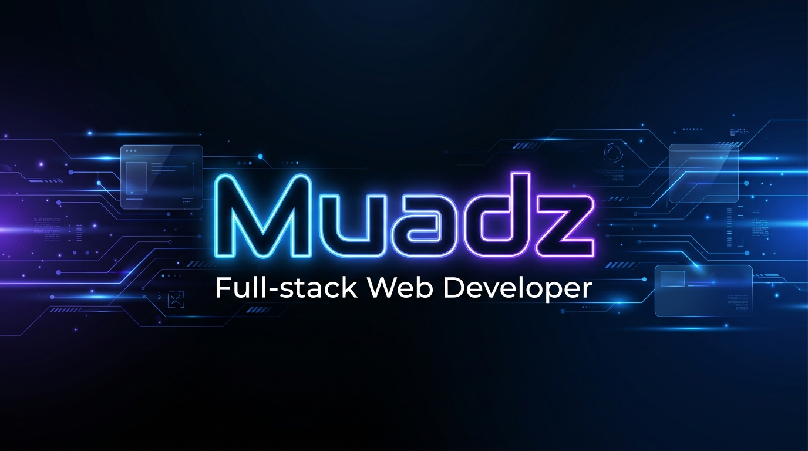

<!-- Header Section -->

  

  
  
  

---

### 💫 About Me

I am a **Full-stack Web Developer** passionate about optimizing system performance and building modern, high-quality applications. I love leveraging state-of-the-art tech stacks like **Next.js**, **Astro**, **Laravel**, and **Cloudflare ecosystem** to build systems that solve real-world problems.

- 🔭 Currently active in developing open-source and organizational platforms.
- 🌱 Currently learning Rust, web technologies, and AI/Machine Learning.
- ⚡ Fun fact: I enjoy building automated tools (like WhatsApp bots and PDF helpers) to streamline daily workflows.

---

### 📂 Featured & Recent Projects

Here are the top 5 projects I have been actively developing and contributing to recently, spanning personal work and organizational collaborations:

| # | Project | Tech Stack | Key Highlights |
| :--- | :--- | :--- | :--- |
| 1 | **[PPI Turki Integrated Info System](https://github.com/ppiturki/ppit)** | Next.js 15, Bun, Drizzle ORM, Better Auth, Cloudflare R2, Shadcn UI | Central Identity Provider (IdP) & Single Source of Truth for Indonesian students in Turkey. Built features for events, elections, and store. |
| 2 | **[E-Kinerja Guru](https://github.com/codeszeros5/e-kinerja)** | Laravel 13, PHP 8.3, React 18, Inertia.js, Tailwind CSS, MySQL | Enterprise 360-degree performance evaluation system for Teachers & educational staff. Featuring activity logging, permissions, and PDF/Excel reports. |
| 3 | **[Zeroos Logistic Boilerplate](https://github.com/codeszeros5/zeroos-logistic)** | Next.js 15, PostgreSQL, Drizzle ORM, Better Auth, Mailjet, R2 | A production-ready boilerplate template containing features flags, audit logging, rate limiting, and structured Pino logging. |
| 4 | **[HR Harika Indonesia](https://github.com/maviismbusiness/hrharikaindonesia)** | Astro, TypeScript, MDX, CSS, Google Analytics 4 | Cultural campaign and tour & travel booking platform for Bali. Features multi-language routing (Turkish/English), automated sitemaps, SEO metadata, and GA4 click/lead tracking. |
| 5 | **[Efessa ERP (PHP Edition)](https://github.com/Maviism/efessa-erp-php)** | Custom PHP MVC, MySQL, Playwright | A custom-built Enterprise Resource Planning system. Built on a lightweight PHP MVC architecture with Laravel-style routing, custom middlewares, end-to-end Playwright tests, and automated audit logging. |

---

### 🛠️ Tech Stack & Skills

<table width="100%">
  <tr>
    <td valign="top" width="50%">
      <h4>🌐 Frontend Development</h4>
      
      
      
      
      
      
       
      
      
      
    </td>
    <td valign="top" width="50%">
      <h4>⚙️ Backend & Databases</h4>
      
      
      
      
      
       
      
      
      
      
    </td>
  </tr>
  <tr>
    <td valign="top" width="50%">
      <h4>☁️ Infrastructure & Tools</h4>
      
      
      
      
      
       
      
      
      
    </td>
    <td valign="top" width="50%">
      <h4>🎯 Other Technologies</h4>
      
      
      
      
    </td>
  </tr>
</table>

---

### 📊 GitHub Stats

  

---

